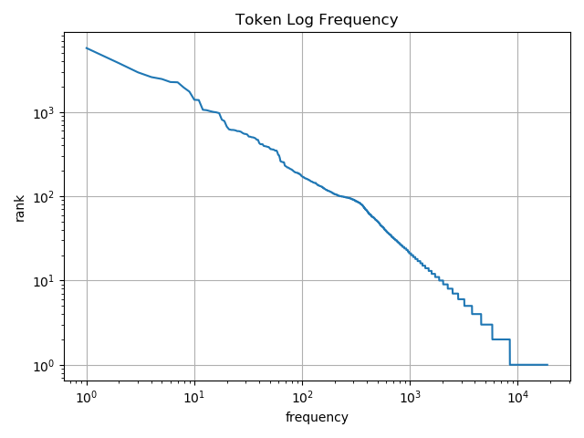
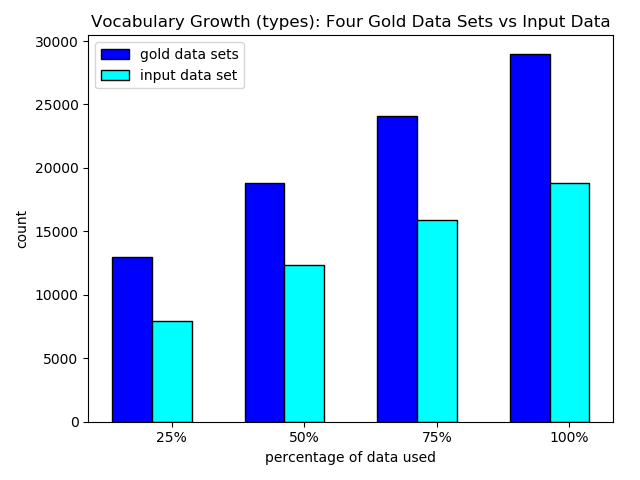
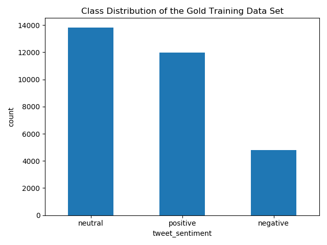
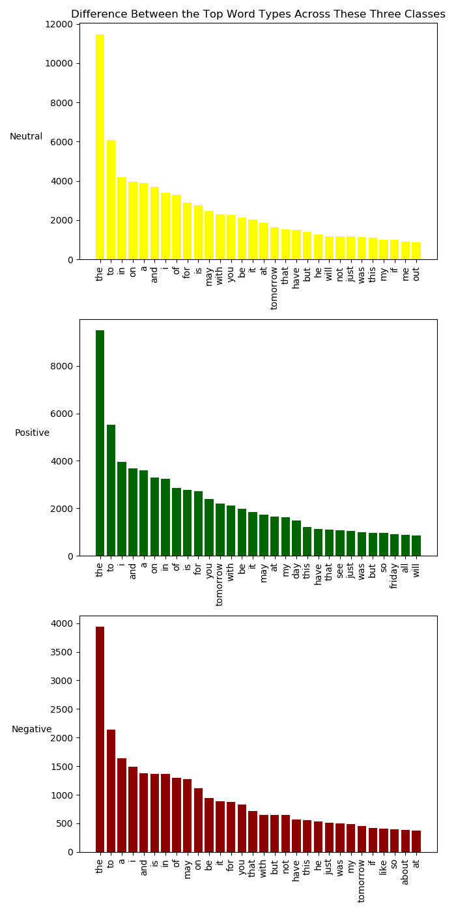

# NLP Sentiment Analysis of English Twitter
## Team
Dance Squad: Chelsea Wang, Jiaqi Tang, Xinyi Ye, Jingjing Lin

## Objective
In this Sentiment Analysis task, we aim to predict the affective states and subjective information (Positive, Neutral and Negative) of each twitter message using Naive Bayes and Logistic Regression models. 

There are 3 parts in this project:

1)Exploratory Data Analysis: conducting exploratory data analysis (EDA) of example("INPUT.txt") twitter messages; 

2)Message polarity classification: training data with Naive Bayes Model and Logistic Regression Model and validating those two models using additional datasets;

3)Performance evaluation: using test data to demonstrate the performance of classifiers (models)

## Datasets

+ Data/Dev - This is your INPUT file (INPUT.txt); the data you will classify
+ Data Gold - train.txt. This is the data for training your model.
+ Data/Gold - dev.txt. This is the validation data set for tuning your model.
+ Data/Gold - devtest.txt. This is what you can evaluate your results with during your development time.
+ Data/Gold - test.ext.  This is what you can use to evaluate your results before you provide you a final test set.
+ Data/Test - This is the (gold) data for evaluating your model. We will provide this data set the day your assignment is due, thus the folder is empty.

## Code Instruction
There are two python files in this project

 - Exploratory Data analysis.py, for part 1) eda
 - Gold EDA.py, for part 1) gold
 - MessagePolarityClassificationandEvaluation.py, for part 2) and part 3)
 
 Four graphs
 - tokenLogFrequency.png: Part1 input data EDA graph
 - ClassDistribution1.png: Part1 GOLD graph
 - DifferenceClass1.png: Part1 GOLD graph
 - GrowthGraph.png: Part1 GOLD graph
 
 One output file for the results of the INPUT.txt file
 
 - data/Dev/Output.csv
 
 It takes around 40 minutes to run the entire project.

### Task 1: Exploratory Data Analysis (EDA)

#### Input data
- [x] The total number of tweets
- 12284
- [x] The total number of characters
- 1343152
- [x] The total number of distinct words (vocabulary)
- 18816
- [x] The average number of characters and words in each tweet
- The average number of characters per tweet is 82.8 and the average number of words per tweet is 14.3
- [x] The average number and standard deviation of characters per token
- The average number of characters per token per tweet is 5.1 and the average standard deviation per tweet's token is 1.2
- [x] The total number of tokens corresponding to the top 10 most frequent words (types) in the vocabulary
- [('the', 5733), ('to', 3792), ('a', 2954), ('of', 2594), ('and', 2461), ('in', 2267), ('is', 2251), ('for', 1945), ('i', 1744), ('on', 1396)]
- [x] The token/type ratio in the dataset
- 8.73203656462585
- [x] The total number of distinct n-grams (of words) that appear in the dataset for n=2,3,4,5.
- The total number of distinct bigrams of words that appear is:  103027
- The total number of distinct trigrams of words that appear is:  138368
- The total number of distinct 4 -grams of words that appear is:  137568
- The total number of distinct 5 -grams of words that appear is:  128038

- [x] The total number of distinct n-grams of characters that appear for n=2,3,4,5,6,7
- The total number of distinct bigrams of characters that appear is:  4055
- The total number of distinct trigrams of characters that appear is:  30172
- The total number of distinct 4 -grams of characters that appear is:  102907
- The total number of distinct 5 -grams of characters that appear is:  224453
- The total number of distinct 6 -grams of characters that appear is:  364633
- The total number of distinct 7 -grams of characters that appear is:  493514

- [x] Plot a token log frequency. Describe what this plot means and how to interpret it. Describe out it might help you understand coverage when training a model?

- It means the product of frequency  and rank is constant. It is an observation of Zipf's Law, which desribes the word behaviour in an entire corpus and can be regarded as a roughly accurate characterization of certain empirical facts. That is, the frequency of words multiplied by their ranks in a large corpus is approximately constant.

#### Gold
- [x] What is the number of types that appear in the dev data but not the training data (OOV).?
- 8442

- [x] Look at the vocabulary growth (types) combining your four gold data sets against your input data. Plot vocabulary growth at difference sample sizes N.

- [x] What is the class distribution of the training data set - how many negative, neutral, positive tweets?

- [x] Look at the difference between the top word types across these three classes.

- [x] What words are particularly characteristic of your training set and dev set? Are they the same? 

The total number of distinct words (vocabulary) in all gold files is 28997

The total number of distinct words (vocabulary) in input file is 18816

index | Bigram | PMI
------ |------------ | -------------
0  | (milton, keynes)  | 14.289941
1  |  (roman, reigns)  | 13.552976
2  |  (bye, felicia)   | 13.330583
3  |  (andre, berto)   | 13.126988
4  | (jordan, spieth)  | 13.087312
5  | (kenny, chesney)  | 12.989075
6  |   (jon, stewart)  | 12.928285
7  | (outta, compton)  |12.925058
8  |(cate, blanchett)  | 12.833943
9  | (trending, topic) | 12.833563

index |   trigram    |   PMI
------ |------------ | -------------
0  |(straight, outta, compton)  |24.741068
1  |        (magic, mike, xxl)  |24.134072
2  |   (mtvstars, lady, gaga)  |22.615695
3  |           (moto, g, gen)  |22.444829
4  |   (vice, president, joe)  |22.055289
5  |     (miss, usa, pageant)  |22.049870
6  |        (zac, brown, band)  |22.049061
7  |              (gt, gt, gt)  |21.234634
8  |  (charlie, hebdo, attack)  |21.094493
9  |        (ohio, gov, john) | 21.018691

We can see that PMI picks up bigrams and trigrams that consist of words that should co-occur together.

The following lists are the result from Input file。

Index  |   Bigram     | PMI         
------ | ------------ | -------------
0   |      (kate, upton)  | 12.618004
1   |    (self, driving)  | 11.720269
2   | (spurs, gospursgo)  | 11.707271
3   |    (ricky, martin)  | 11.374706
4   |     (mike, pence)   | 11.262296
5   |      (jill, stein)  | 11.249175
6   |     (north, korea)  | 10.933673
7   |   (ashley, graham)  | 10.856624
8   | (justin, verlander) | 10.830033
9   |   (dakota, access)  | 10.822165

Index  | trigram | PMI
------ | ------------ | -------------
0      | (self, driving, cars)    | 22.338273
1      |(dakota, access, pipeline)| 21.807926
2      |    (marine, le, pen)     | 21.302147
3      |  (samsung, galaxy, note) | 20.523181
4      |    (google, earth, vr)   | 20.345037
5      | (palestine, israel, bds) | 20.275346
6      |         (kim, jong, un)  | 19.951652
7      | (gaza, palestine, israel)| 19.739293
8      |      (tesla, model, s)   | 18.333268
9      |      (liked, a, video)   | 15.777752

### Task 2: Message Polarity 

- Model Choosing
  - Based on the EDA and our evaluation, we chose two models (Naive Bayes and Logistic Regression) to train our data.
  
- Preprocess
  - We performed the basic data cleaning process such as remove the stop words, url and emoji. For the tokenization part, at first, we used the stemming to perform tokenization, the accuracy of the Logistic Regression Model is around 0.50. For achieving a better result,  we tried the lemmatization however the accuracy did not increase.
  
- Features extraction and implementation decisions description 
  - Since the based on f1 scores,recall, precision, logistic regression attains higher scores than navie bayes, also in this project, we used tunning methods for change the parameter for  logistic regression. So after feature extraction, we choose logistic regression. In additon, for feature selection, we removed high frequency and rare frequency words for better prediciton modeling, we use stem and lemmatize, remove stop words tokenized method for feature generation and selection.

### Task 3: Performance evaluation

- Create a results table that compares performance of the algorithms you chose for analysis. 

Evaluating NaiveBayesClassifier results

Name | Rate
------ |------------ 
Accuracy | 0.5015 
Precision (neutral)|0.4350132625994695
Recall (neutral) | 0.24082232011747431 
F-measure (neutral) |0.31001890359168244 
Precision (positive)|0.6670092497430626
Recall (positive)|0.6529175050301811
F-measure (positive) |0.6598881545500762
Precision (negative)|0.2923076923076923
Recall (negative)|0.5846153846153846
F-measure (negative) |0.38974358974358975

Evaluating Logistic Regression results

Name | Rate
------ |------------ 
Accuracy | 0.5355 
f1 scores (negative)|0.20574163
f1 scores (neutral) | 0.43490909
f1 scores (postive) |0.66062528
Recall  (negative)|0.13230769
Recall (neutral)|0.43906021
Recall (positive) |0.7334004
Precision (negative)|0.46236559
Precision (neutral)|0.43083573 
Precision (positive) |0.60098928

As we could see from the result, the Logistic Regression Model has a better perfomance. After applying to the final test data, the final results are below:

Name | Rate
------ |------------ 
Accuracy | 0.5138619620007755
f1 scores (negative)|0.22773231
f1 scores (neutral) | 0.51385585
f1 scores (postive) |0.57632284
Recall  (negative)|0.14639431
Recall (neutral)|0.44913943
Recall (positive) |0.77688058
Precision (negative)|0.51245937 
Precision (neutral)|0.6003619
Precision (positive) |0.45806883

- Speculate on the differences between the two performance measures above.

  - There are some differences between the f1 and recall, for example, when we perform navie bayes we can see that for negative label，f1 scores is higher than recall, however,for postive label, recall is higher, however, generally, the trends of f1 scores and recall scores for classes are similar since both of them are used to measure accuracy of each classes.

- Look at your results and find / show examples where your classifiers have mis-performed. What sorts of phenomena do you see and speculate on why you see these errors. Are there distinct differences between classifiers or are differences difficult to see from your results?

  - After preprocessing, there are only few words in some tweets so that it is got mis performed since information loss. there are no distinct differences between classifier that can be seen from the result.
 
  
- How important was tokenization / feature extraction?
  - Without tokenize, we only have a cloumn of string text ,then it will only have one feature, in this case, we used tokenize to generate features for better prediction and create more dimensions.

- If you had more time, what might you do differently? What questions do you know have about your analysis that you didn't have before starting?

  - If we have more time, we need more time to do feature selection and processing text data, for example, we will try to use different n grams to see if it can improve performance.

